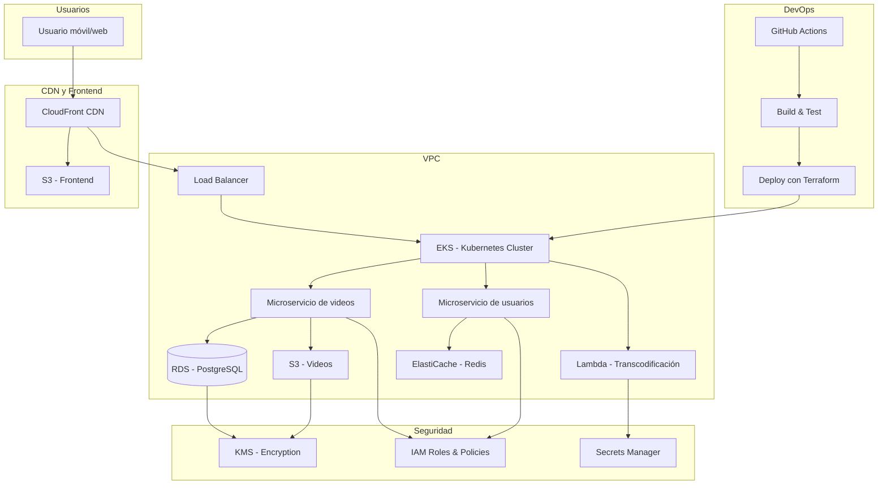

```mermaid
graph TD
  subgraph CDN y Frontend
    CF[CloudFront CDN] --> S3F[S3 - Frontend]
  end

  subgraph Usuarios
    U1[Usuario móvil/web] --> CF
  end

  subgraph VPC
    CF --> LB[Load Balancer]
    LB --> EKS[EKS - Kubernetes Cluster]
    EKS --> BE1[Microservicio de videos]
    EKS --> BE2[Microservicio de usuarios]
    EKS --> Lambda[Lambda - Transcodificación]
    BE1 --> RDS[(RDS - PostgreSQL)]
    BE2 --> Redis[ElastiCache - Redis]
    BE1 --> S3V[S3 - Videos]
  end

  subgraph Seguridad
    IAM[IAM Roles & Policies]
    KMS[KMS - Encryption]
    Secrets[Secrets Manager]
    BE1 & BE2 --> IAM
    RDS --> KMS
    S3V --> KMS
    Lambda --> Secrets
  end

  subgraph DevOps
    Dev[GitHub Actions]
    Dev --> CI[Build & Test]
    CI --> CD[Deploy con Terraform]
    CD --> EKS
  end
```